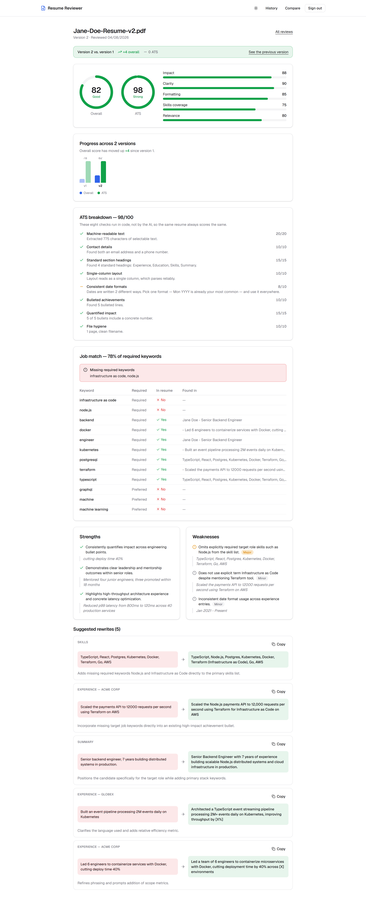
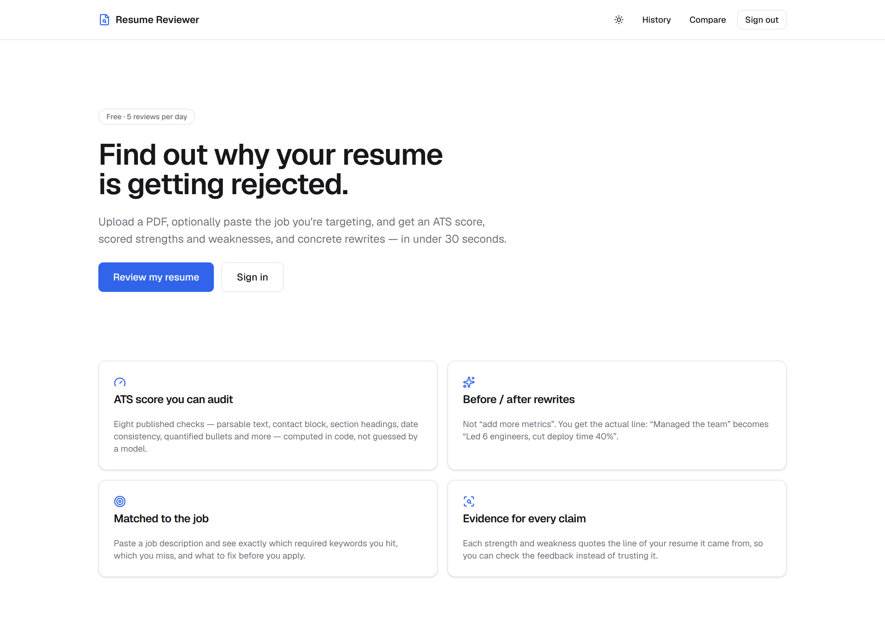
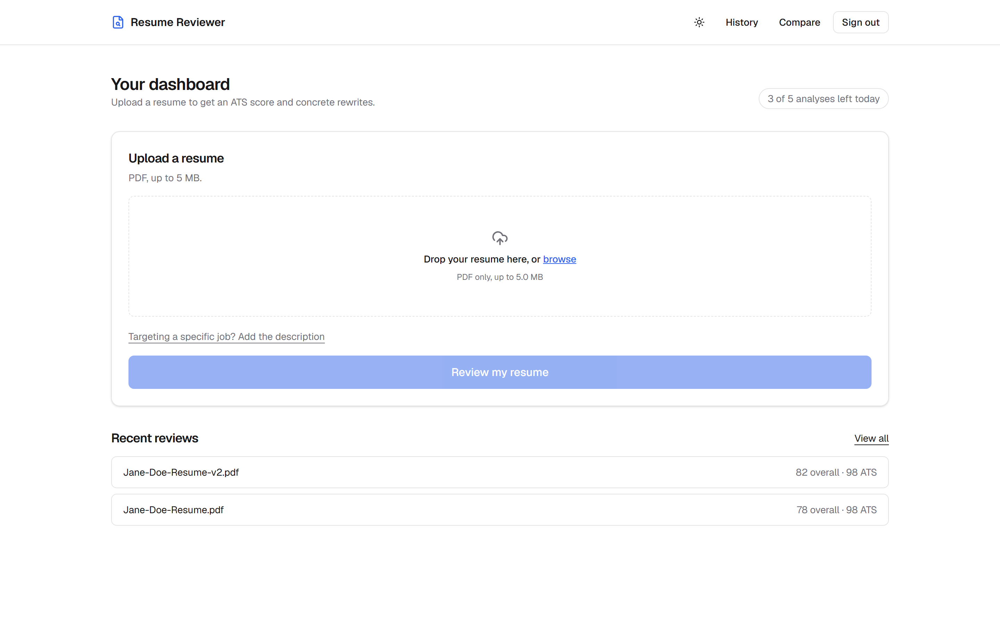
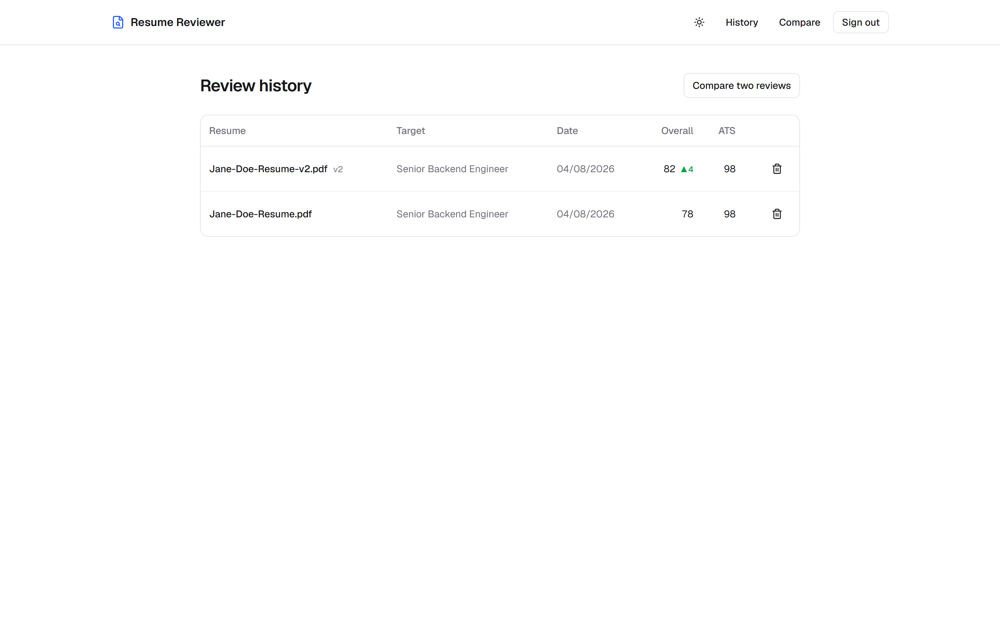
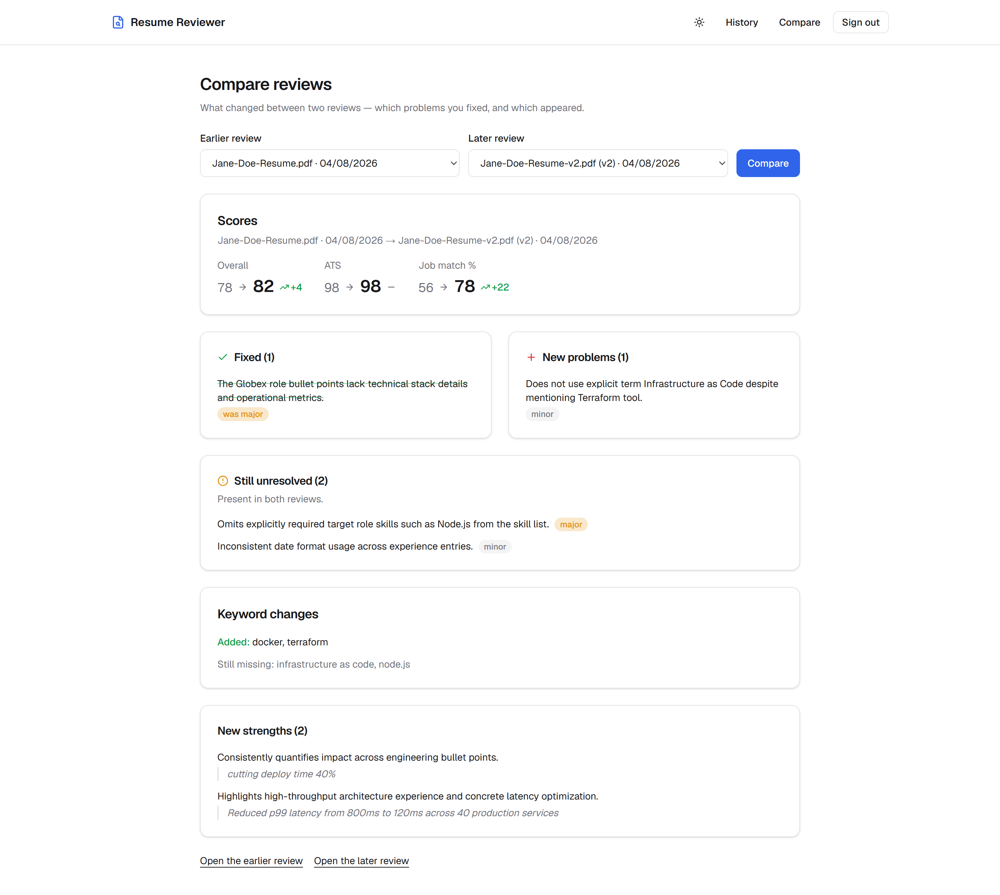
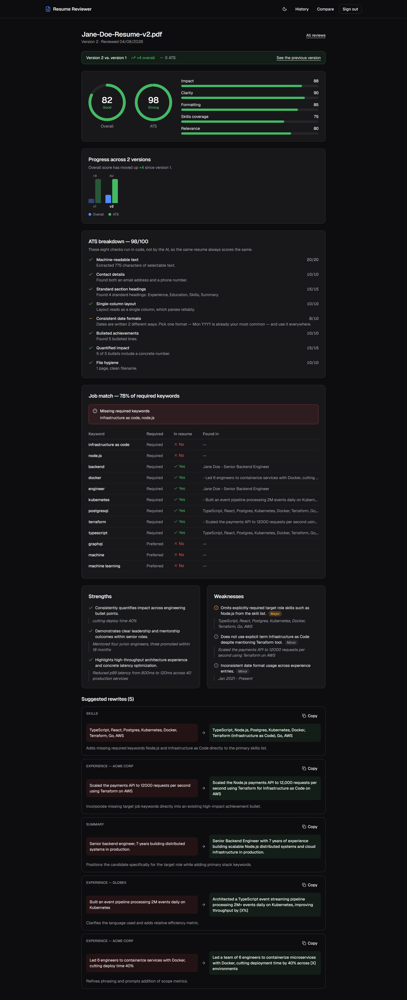
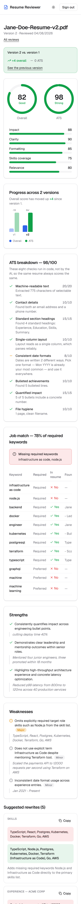
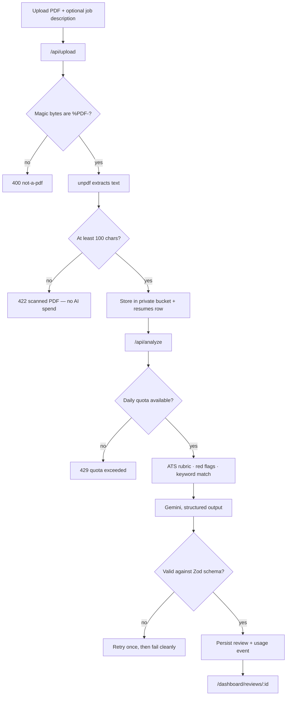

# AI Resume Reviewer

Upload a resume, optionally paste the job you're targeting, and get an ATS score you can audit, scored strengths and weaknesses that quote your own resume back at you, and rewrites you can paste straight in.

Built with Next.js 16, Supabase and Gemini.



---

## Why this is not another "AI resume score"

Most resume checkers ask a language model for a number. Models cannot count, so that number is invented, and it changes between runs on the same file. Three deliberate decisions here:

**1. The ATS score is computed in code, not by the AI.** Eight weighted checks run in TypeScript. The model receives the results as fact and may comment on them, but it can never set or contradict them. The [full rubric is published below](#the-ats-rubric) — the same resume always scores the same.

**2. Every claim quotes your resume.** Each strength and weakness carries an `evidence` field containing a verbatim quote. If the model can't find a supporting line, it isn't allowed to make the point. This is what stops invented feedback about experience you don't have.

**3. Suggestions are rewrites, not advice.** "Add more metrics" is useless. Every suggestion has a `before` (your current wording) and an `after` you can paste in:

> **before:** "Led 6 engineers and cut deploy time 40%"
> **after:** "Led 6 engineers to containerize microservices using Docker and Terraform on AWS, cutting production deploy time by 40%."

That example is real output. The rewrite folded in `Docker` and `Terraform` because the target job required them and the resume was missing both.

---

## Features

- **Deterministic ATS score** — 8 published checks, each returning the evidence it used
- **Job description targeting** — paste a posting, get a match percentage and a keyword table showing exactly what's missing
- **Evidence-backed feedback** — 3–6 strengths and 3–6 severity-tagged weaknesses, each quoting the resume
- **Before/after rewrites** — 5–10 paste-ready suggestions
- **Sub-scores** — impact, clarity, formatting, skills coverage, relevance
- **Rule-based red flags** — employment gaps, missing dates, pronoun mixing, buzzwords, unprofessional emails, draft filenames. Costs no tokens and can't hallucinate.
- **Scanned-PDF detection** — image-only PDFs are rejected before any AI call, so they don't burn quota
- **Version tracking** — a re-upload is recognised as the next version of the same resume, with the score movement since last time
- **Compare any two reviews** — which weaknesses you fixed, which appeared, which are still there, and how the keyword match moved
- **Review history** — every analysis is stored, permalinked and deletable
- **Daily quota** — 5 analyses per user, enforced in Postgres
- **Light and dark themes**, responsive to 360px, keyboard accessible

---

## Screenshots

| | |
|---|---|
|  **Landing** |  **Upload** |
|  **History** — version tags and score movement |  **Compare** — fixed, new, and still-unresolved |
|  **Dark mode** | |



Fully usable at 360px — wide tables scroll inside their own container, so the page body never scrolls sideways.

---

## The ATS rubric

All eight checks run in [`lib/resume/ats.ts`](lib/resume/ats.ts) against the extracted text. Score is the weighted sum. Some checks award partial credit.

| Check | Weight | Passes when |
|---|---:|---|
| Machine-readable text | 20 | At least 400 characters of selectable text extracted |
| Contact details | 10 | Both an email address and a phone number are present |
| Standard section headings | 15 | At least 3 of: Experience, Education, Skills, Projects, Summary |
| Single-column layout | 10 | No run of 3+ lines that look like table or multi-column content |
| Consistent date formats | 10 | 80%+ of dates use one format |
| Bulleted achievements | 10 | At least 5 bullet-leading lines |
| Quantified impact | 15 | At least 3 bullets contain a percentage, currency, multiplier or 2+ digit number |
| File hygiene | 10 | 1–2 pages, and a filename without spaces or special characters |

**Why "quantified impact" is weighted highest after parsability:** it's the single clearest separator between a resume that advances and one that doesn't.

**Why the date check is fiddly:** `YYYY` also matches inside `Jan 2021`, so bare-year matches have the specific-format matches subtracted before the dominant format is chosen. Without that, every resume looks inconsistent.

---

## Tech stack

| Layer | Choice | Why |
|---|---|---|
| Framework | Next.js 16.2 (App Router) | Server Components, route handlers, Turbopack |
| Language | TypeScript 5, `strict` | |
| UI | React 19.2, Tailwind CSS v4 | Tokens live in CSS; v4 has no JS config file |
| Auth / DB / Storage | Supabase | Postgres with RLS, plus private object storage |
| AI | Gemini (`gemini-3.6-flash`) | Structured output driven by the Zod schema |
| PDF text | `unpdf` | Serverless-native; avoids the Node-native issues `pdf-parse` hits under Turbopack |
| Validation | Zod | One schema shared by the API contract and the model's output |
| Hosting | Vercel | |

---

## Architecture



Everything deterministic runs **before** the model, and its results are passed in as established fact. The model's job is judgement and wording, not arithmetic.

### Layout

```
app/
  (auth)/          login, signup, password reset, server actions
  (dashboard)/     dashboard, review history, single review
  api/upload/      validate, store, extract
  api/analyze/     quota, rubric, keywords, model call, persist
  auth/callback/   OAuth + email confirmation exchange
proxy.ts           session refresh + route guard  (Next 16 renamed middleware)
lib/
  ai/              schema (Zod contract), prompt, provider
  resume/          extract, ats, keywords, red-flags
  supabase/        server + browser clients
scripts/           rls-gate.mjs, e2e.mjs, PDF fixtures
supabase/          SQL migration
```

---

## Running locally

### Prerequisites

- **Node.js 20.9+** (Next 16 requires it; Node 18 is unsupported)
- A [Supabase](https://supabase.com) project
- A [Google AI Studio](https://aistudio.google.com/apikey) API key

### 1. Install

```bash
git clone https://github.com/Zainab-105/ai_resume_reviewer.git
cd ai_resume_reviewer
npm install
```

### 2. Environment

```bash
cp .env.example .env.local
```

Fill in:

```bash
NEXT_PUBLIC_SUPABASE_URL=https://<your-project-ref>.supabase.co
NEXT_PUBLIC_SUPABASE_ANON_KEY=      # "publishable" key in newer dashboards
NEXT_PUBLIC_SITE_URL=http://localhost:3000
GOOGLE_GENERATIVE_AI_API_KEY=
```

Both Supabase values come from **Project Settings → API**. The publishable/anon key is public by design — it ships in the browser bundle, and RLS is what protects the data.

`SUPABASE_SERVICE_ROLE_KEY` is optional and **intentionally unused**: it bypasses RLS entirely, and every query here runs as the signed-in user instead.

### 3. Database

Paste [`supabase/migrations/0001_init.sql`](supabase/migrations/0001_init.sql) into the Supabase SQL editor and run it. That creates five tables, RLS policies on all of them, the private `resumes` bucket with its storage policies, a profile-creation trigger, and the quota function.

### 4. Auth settings (local development)

In **Authentication → Sign In / Providers → Email**, turn **Confirm email** off. Otherwise signup requires an inbox round-trip before you can sign in.

Turn it back on before deploying publicly — it's what stops people signing up with addresses they don't own.

Google sign-in needs an OAuth client configured in Supabase; email/password works without it.

### 5. Run

```bash
npm run dev
```

---

## Deploying to Vercel

1. Import the repository at [vercel.com/new](https://vercel.com/new).

2. **Add the environment variables before the first build.** Under *Settings → Environment Variables*, tick Production, Preview and Development for each:

   | Variable | Value |
   |---|---|
   | `NEXT_PUBLIC_SUPABASE_URL` | `https://<project-ref>.supabase.co` |
   | `NEXT_PUBLIC_SUPABASE_ANON_KEY` | your publishable / anon key |
   | `GOOGLE_GENERATIVE_AI_API_KEY` | your Gemini key |
   | `NEXT_PUBLIC_SITE_URL` | your production URL — **not** `localhost:3000` |

   Missing values fail the build at "Collecting page data", not at compile time — [`lib/env.ts`](lib/env.ts) validates them at module load so a misconfigured deploy fails loudly instead of 500ing at runtime. Environment variables only apply to *new* builds, so redeploy after adding them.

3. **Point Supabase at the production domain.** Under *Authentication → URL Configuration*, set the Site URL to your Vercel domain and add `https://your-app.vercel.app/**` to Redirect URLs. Skipping this is the most common first-deploy breakage — auth redirects bounce to localhost.

4. **Re-enable "Confirm email"** in *Authentication → Sign In / Providers → Email*, if you turned it off for local development. Leaving it off in production lets anyone sign up with an address they don't own.

5. Either configure a Google OAuth client in Supabase, or remove the Google button — with only the email provider enabled it fails.

6. Smoke-test the whole flow in an incognito window.

---

## Testing

```bash
npm test           # 25 unit tests — rubric, red flags, keywords, schema contract
npm run test:rls   # cross-user security gate (needs a running Supabase project)
npm run test:e2e   # full pipeline, real Gemini call (needs npm run dev running)
```

**`npm test`** covers the deterministic parts. The fixtures in [`lib/resume/__tests__/fixtures.ts`](lib/resume/__tests__/fixtures.ts) carry expected score bands, so a rubric change that moves a resume out of its band fails the suite rather than silently regressing.

**`npm run test:rls`** creates two real users, has A insert a resume, then has B attempt to read it by id, scan the whole table, filter on A's `user_id`, update it, delete it, forge a row owned by A, and list A's storage folder. All ten must fail. It runs over the REST API, bypassing the UI — a UI that merely hides other users' data is not security.

**`npm run test:e2e`** drives the real routes over HTTP with a cookie jar: signup → upload → extraction → a real model call → the persisted review → the rendered page → quota accounting. 32 checks. It also confirms scanned PDFs and disguised non-PDFs are rejected before any AI spend.

---

## Security and privacy

Resume text is personal data, and it's treated that way.

- **RLS on every table**, every policy scoped to `auth.uid() = user_id`, verified by the cross-user gate above
- **Private storage bucket.** Object paths are `{user_id}/{resume_id}.pdf`, and the storage policy requires the first path segment to equal the caller's own id
- **Server-side file validation.** PDFs are identified by their `%PDF-` magic bytes; a client-supplied `Content-Type` proves nothing
- **`getUser()`, not `getSession()`,** for anything that gates access — `getSession()` trusts the cookie, `getUser()` revalidates with the auth server
- **No account enumeration.** Sign-in errors are generic, and password reset always reports success whether or not the address exists
- **`?next=` is restricted to relative paths**, so it can't be turned into an open redirect
- **Server-only keys are validated separately** from public ones and never imported into a Client Component
- **Security headers** set in [`next.config.ts`](next.config.ts)

---

## Notes on Next.js 16

Version 16 changed several things that most tutorials still get wrong:

| Change | What this project does |
|---|---|
| `middleware.ts` is deprecated | [`proxy.ts`](proxy.ts) at the root, exporting `proxy`. Node runtime only — `edge` is unsupported here. |
| `cookies()` / `headers()` are async | Always awaited; synchronous access was removed, not deprecated |
| `params` / `searchParams` are Promises | Awaited in every page and route |
| `revalidateTag('x')` is a type error | Needs a `cacheLife` argument. These reads are per-user and uncached, so deletes use `refresh()` instead. |
| Turbopack is the default builder | Dependencies that inject a webpack config fail the build — one reason for `unpdf` over `pdf-parse` |
| Proxy without a `matcher` runs on static assets | A negative matcher excludes `_next/static`, images and fonts |
| Tailwind v4 has no `tailwind.config.js` | Design tokens live in [`app/globals.css`](app/globals.css) under `@theme` |

One more, learned the hard way: **`/v1beta/models` lists Gemini models your key cannot actually call.** `gemini-2.5-flash` is listed but returns 404 "no longer available to new users" on newly created keys. The provider therefore walks a candidate list and falls through on 404, and records whichever model actually answered. `GEMINI_MODEL` pins one if you need it.

---

## Roadmap

- [x] Score delta on re-upload — "ATS 61 → 78 since your last version"
- [x] Compare two reviews side by side
- [ ] Export the report as a PDF
- [ ] Anonymous demo mode, no signup required
- [ ] Shareable read-only report links
- [ ] Interview questions generated from the resume
- [ ] Cover letter draft from resume + job description
- [ ] Readability and jargon meter
- [ ] Prompt evaluation harness for safe prompt changes

---

## Data handling

Uploaded PDFs and their extracted text are stored in your own Supabase project. Resume text is sent to Google's Gemini API for analysis. If you deploy this for other people, say so plainly on the landing page and check the provider's current data-retention terms.

---

## License

MIT
